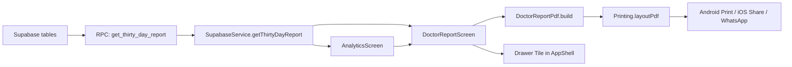
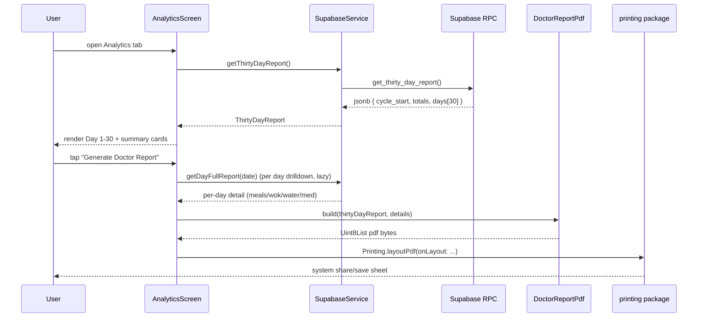
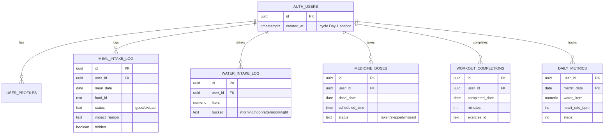

## Plan: 30-day Doctor Cycle (analytics + PDF)

The app becomes a tool for the monthly doctor visit: from the moment a user signs up, every day is recorded under that cycle, and a single screen surfaces a day-by-day view of meals, water, workouts and medicine for the full 30 days. Days the user never opened the app appear with zeros so the doctor sees the truth. A PDF generator produces a printable, shareable copy.

**Steps**

1. **Confirm the signup anchor.** `auth.users.created_at` already exists in Supabase; `public.user_profiles` is created in `08_signup_identity.sql`'s trigger immediately after signup. The cycle Day 1 = `(now() at time zone 'Asia/Dhaka')::date` of the user's `auth.users.created_at`. No new column needed — anchor is derived. (depends on existing schema)
2. **Add SQL RPC `27_thirty_day_report.sql`.** Single round-trip function `get_thirty_day_report()` that returns `jsonb` with: `cycle_start` (auth.users.created_at date), `today`, `day_of_cycle` (1–30, capped), `totals { meals_planned, meals_eaten, swaps, off_plan, water_liters, workout_minutes, exercises_completed, doses_taken, doses_total, ...}`, `days[]` where each entry has `date, day_index, weekday_bn, planned_meals[], eaten_meals[] (with status: good/ok/bad), water_liters, workout_done boolean + exercises[], doses_taken/total}`. Use one `generate_series` to enumerate all 30 days so missing days yield zeros automatically. (parallel with 3)
3. **Add SQL RPC `27_daily_detail.sql`.** Single-day drill-down `get_day_full_report(p_date)` so the per-day accordion can lazy-load the recipes/notes for one day without re-fetching the whole cycle. (parallel with 2)
4. **Add Flutter dependencies.** `pdf: ^3.11.1` and `printing: ^5.13.4` to `pubspec.yaml`, then `flutter pub get`. (parallel with 5)
5. **Extend `SupabaseService`.** Add `getThirtyDayReport()` and `getDayFullReport(date)` wrapper methods returning typed Dart models. New `lib/models/thirty_day_report.dart` with `ThirtyDayReport`, `ThirtyDayReportDay`, `ThirtyDayReportTotals`. (depends on 2, 3)
6. **Rebuild `AnalyticsScreen` for the 30-day cycle.** Replace the 7-day window with: a hero "Cycle Day N of 30" card (large circular progress), summary cards (Meals / Water / Workout / Medicine adherence %), a horizontal scrollable day-strip that shows every day 1–30 (tap → day bottom sheet with detail), and a "Generate Doctor Report (PDF)" button that pushes the `DoctorReportScreen`. Pre-cycle days outside the window are hidden. Missing days in-cycle show zero bars. (depends on 5)
7. **New `DoctorReportScreen`.** Title bar with patient name, mobile, clinical classification tier, age/sex, cycle window ("১ আগস্ট ২০২৬ – ৩০ আগস্ট ২০২৬"); section chips (Summary → Meals → Water → Workout → Medicine → Day-by-day); shareable PDF button wired to `printing`. (depends on 5)
8. **Add `DoctorReportPdf` builder in `lib/services/report_pdf.dart`.** Uses `pdf` package to lay out: cover page (name/age/mobile/clinical tier/cycle days), summary KPIs, day-by-day table (one row per day, columns: date | meals eaten / planned | water L | workout ✓ | meds %), page-break to a per-meal appendix listing each eaten meal with status color + reason. (depends on 4, 5)
9. **Wire PDF preview via `printing`.** `Printing.layoutPdf(onLayout: ...)` opens the system print/share sheet (Android print framework, iOS share, web) so the user can save to Downloads / Files / WhatsApp. (depends on 8)
10. **Add entry point.** Update `lib/widgets/apon_susthota_shell.dart` (drawer) to add `বিশ্লেষণ` → already present, but add a new `ডাক্তারের রিপোর্ট` tile that pushes `DoctorReportScreen`. Also surface the same PDF action from the Analytics screen's "Generate" button. (depends on 7)
11. **Update `README.md`.** Append the new SQL file (`27_thirty_day_report.sql`) to the run-order list and add a "Doctor Report (30-day)" section explaining usage and PDF output. (depends on 2)

**Relevant files**
- `supabasesql/27_thirty_day_report.sql` — NEW: `get_thirty_day_report()` RPC + helpers.
- `lib/models/thirty_day_report.dart` — NEW: typed models for the report payload.
- `lib/services/supabase_service.dart` — APPEND: `getThirtyDayReport()`, `getDayFullReport(date)`.
- `lib/services/report_pdf.dart` — NEW: `DoctorReportPdf.build()` returning `Uint8List` via `pw.Document`.
- `lib/screens/analytics_screen.dart` — REWRITE the body for the 30-day cycle; keep state-management shell.
- `lib/screens/doctor_report_screen.dart` — NEW: hero + sections + PDF button.
- `lib/widgets/apon_susthota_shell.dart` — APPEND a drawer tile that pushes `DoctorReportScreen`.
- `lib/screens/home_shell.dart` — no change; Analytics tab already wired to the rebuilt screen.
- `pubspec.yaml` — APPEND `pdf` and `printing` under `dependencies`.
- `README.md` — APPEND the new SQL file to setup steps and add a "Doctor Report" section.

**Diagrams**

**Verification**
1. Run `supabasesql/27_thirty_day_report.sql` in Supabase SQL Editor; confirm `select get_thirty_day_report()` returns a JSON with exactly 30 day entries between cycle_start and cycle_start+29.
2. Open the app, sign in as a test user older than 30 days — Analytics tab shows "Day 1 – 30" cycle ending yesterday; sign in as a brand-new user — cycle shows current day as Day 1.
3. Skip logging for 2 days — those days in the day-strip render with zero bars and a "তথ্য নেই" badge.
4. Tap "Generate Doctor Report" — PDF preview opens with the system print/share sheet; "Save as PDF" works on Android; sharing via WhatsApp works.
5. Cycle progress circle reflects `day_of_cycle / 30` (e.g. today is Day 7 → circle shows 23% filled).
6. `flutter analyze` returns no new errors; `flutter run -d <device>` cold start under 4 s.
