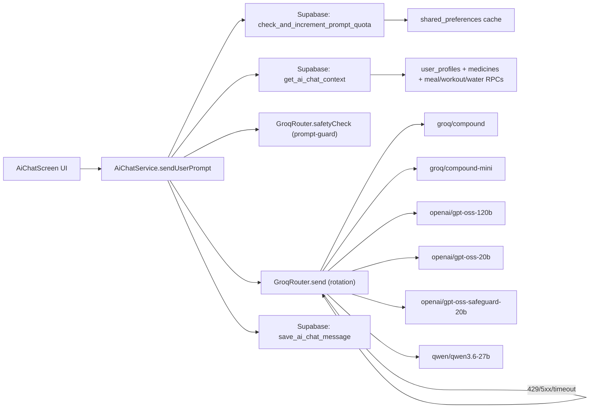
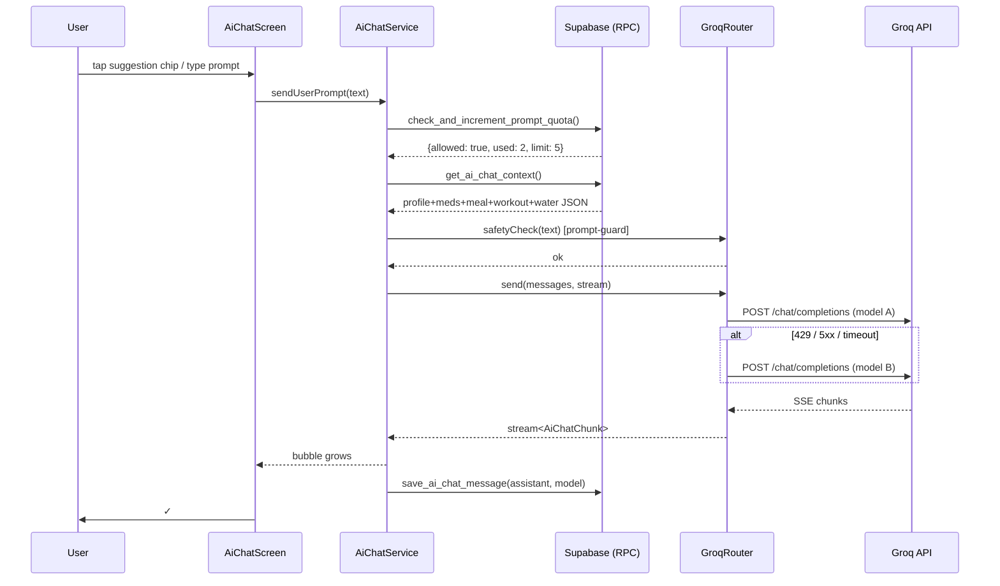
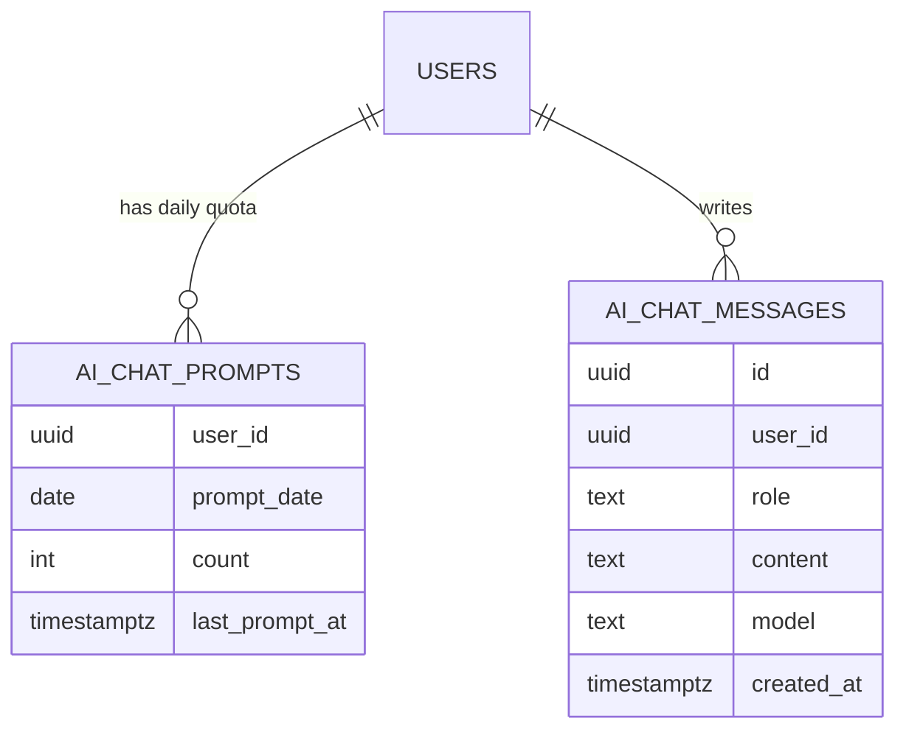

## Plan: AI Chat for Diabetics

TL;DR — A new `AiChatScreen` lives behind a new bottom-nav tab (replaces `ওষুধ`), runs through a `GroqRouter` that rotates the 5 free chat models with automatic fallback on 429/5xx/timeout, enforces a 5 prompts/day cap (Supabase-authoritative + `shared_preferences` cache), and prepends a compact "user context" system message built from `user_profiles`, today's medicines, and today's meal/workout/water adherence so answers can be personalised. The API key lives in `.env` only. All UI is Bangla, elderly-friendly, and matches the existing monochrome theme.

**Steps**

1. **Secrets & env scaffolding**
   - Add `GROQ_API_KEY` to `.env.example` (already commented out by default) and to `.env` with the key the user supplied. Add a parallel `GROQ_API_KEYS` (comma-separated) reserved list so future multi-key rotation is a no-code change.
   - Update `lib/services/supabase_service.dart`-style `flutter_dotenv` reads: add a tiny `lib/services/env.dart` helper that loads `.env` once and exposes `Env.groqApiKey`. `main.dart` already calls `dotenv.load(...)`; the helper just reads it.
   - ⚠️ The user pasted a live Groq key into chat. After merge, they should rotate the key in the Groq console and update `.env` only.

2. **SQL: server-side prompt quota + chat log**
   - New file `supabasesql/25_ai_chat.sql` with two tables (RLS on, `user_id = auth.uid()`):
     - `ai_chat_prompts(user_id uuid, prompt_date date, count int, last_prompt_at timestamptz, PRIMARY KEY(user_id, prompt_date))`
     - `ai_chat_messages(id uuid, user_id uuid, role text, content text, model text, created_at timestamptz default now())` — for "history"-lite replay and abuse review.
   - RPCs (security-definer, gated on `auth.uid()`):
     - `check_and_increment_prompt_quota(p_user_id uuid, p_limit int default 5)` → returns `{allowed bool, used int, remaining int, resets_at timestamptz}` and atomically increments only when `used < p_limit` for today (Asia/Dhaka). Idempotent for the day so a stale local cache doesn't over-count.
     - `get_ai_chat_context(p_user_id uuid)` → returns one JSON with `profile` (age, sex, weight, height, glucose, hba1c, bp, conditions), `medicines_today` (name_bn, dose, scheduled_time, taken status for today), `meal_adherence_today` (eaten/planned), `workout_adherence_today` (completed/total), `water_today_l`, `classification_summary` (glucose_tier, bmi_tier, bp_tier, ckd_stage, daily kcal/carb/protein/fat/sodium targets). Used as system-prompt injection.
     - `save_ai_chat_message(p_user_id uuid, p_role text, p_content text, p_model text)` — fire-and-forget log.
   - Update `README.md` setup section to mention running `25_ai_chat.sql` after `24_*`.

3. **New service: `lib/services/groq_router.dart`**
   - Model rotation table, in priority order (mirrors the free-tier limits screenshot, heaviest first):
     1. `groq/compound` (RPD 250, has web_search/code_interpreter tools)
     2. `groq/compound-mini` (RPD 250)
     3. `openai/gpt-oss-120b` (TPD 200K)
     4. `openai/gpt-oss-20b` (TPD 200K)
     5. `openai/gpt-oss-safeguard-20b` (TPD 200K)
     6. `qwen/qwen3.6-27b` (TPD 200K)
   - `llama-prompt-guard-2-*` (TPD 500K, but `max_completion_tokens: 1`) are *not* chat models — we use them only as a pre-filter on each user message in a separate `safetyCheck(text)` call. If they flag the prompt, we short-circuit with a polite Bangla "এই বিষয়ে আমি সাহায্য করতে পারছি না" instead of routing to the chat models.
   - Per-model request body builder that maps each id → its required params:
     - `groq/compound*`: `temperature: 1`, `top_p: 1`, `compound_custom: {tools: {enabled_tools: [web_search, code_interpreter, visit_website]}}`, `stream: true`.
     - `openai/gpt-oss-*`: `temperature: 1`, `reasoning_effort: medium`, `stream: true`.
     - `qwen/qwen3.6-27b`: `temperature: 0.6`, `top_p: 0.95`, `reasoning_effort: default`, `stream: true`.
   - `GroqRouter.send({messages, systemPrompt, streamSink})`:
     - Sends `POST https://api.groq.com/openai/v1/chat/completions` with `Authorization: Bearer ${Env.groqApiKey}`.
     - Reads `dart:io HttpClient` line-delimited SSE for streaming.
     - On `429 / 5xx / timeout(15s) / connection error` → moves to next model; logs the failure via `debugPrint` with the model id and reason; if *all* models fail, throws `GroqRouterException`.
     - Returns the chosen `model` id alongside the streamed text so the chat UI can label "via gpt-oss-120b" in the corner.
   - Round-robin starting position per user session (random offset) so two heavy users don't always start on the same model.

4. **New service: `lib/services/ai_chat_service.dart`**
   - Owns the prompt quota gate and context building. Exposes:
     - `Stream<AiChatChunk> sendUserPrompt(String text)` — the only method the UI calls.
     - `Future<({int used, int limit, DateTime resetsAt})> getQuota()` — for the header pill.
   - Pipeline per user message:
     1. `final q = await SupabaseService.checkAndIncrementPromptQuota()`; if `!q.allowed` → return Bangla "আজকের জন্য ৫টি প্রশ্ন শেষ — কাল আবার আসুন" stream chunk and stop.
     2. `final ctx = await SupabaseService.getAiChatContext()`; build a compact Bangla system prompt (see template below).
     3. `final safe = await GroqRouter.safetyCheck(text)`; if `!safe` → log refusal, return polite refusal stream chunk.
     4. Build message list: `[system: <context>], [system: "তুমি একজন বা�লা-ভাষী ডায়াবেটিক স্বাস্�্য সহকারী..."], [user: <text>]` (the last few turns of `ai_chat_messages` may be re-injected for memory, capped at 8 turns to keep cost down).
     5. `final (stream, modelId) = GroqRouter.send(messages: msgs)`; pipe chunks out, and on completion call `save_ai_chat_message(role: 'assistant', model: modelId)`.
     6. Fire-and-forget `save_ai_chat_message(role: 'user')` before streaming starts so the prompt is always logged even if the stream crashes.
   - System-prompt template (Bangla, ~300 tokens):
     ```
     তুমি "আমার ডায়েট"-এর AI সহকারী। তুমি শুধু ডায়াবে�িস, খাদ্যাভ্যাস, ব্যায়াম, �ষুধ, রক্তচাপ, কিডনি, হৃদরোগ ও বাংলাদেশি প্রবীণ স্বাস্থ্য বিষয়ে সাহায্য কর।
     - উত্তর সবসময় সংক্ষিপ্ত, বিনয়ী, বাংলায়। ৫-৮ বাক্যের বেশি নয়।
     - ওষুধের ডোজ, ইনসুলিন, বা চিকিৎসা পরিবর্তনের পরামর্শ দিও না — বল "এ ব্যাপারে আপনার ডাক্তারের সাথে কথা বলুন।"
     - ব্যবহারকারীর প্রোফাইল/ওষু�/আজকের খাবার/ব্যায়াম/পানির তথ্য নিচে দেওয়া আছে; সেগুলো ব্যবহার করে উত্তর দাও।
     <user_context>${ctx.toJsonString()}</user_context>
     ```

5. **State + cache: `lib/services/ai_chat_quota_cache.dart`**
   - `shared_preferences` key `ai_chat_quota_YYYY-MM-DD` storing `{used, resetsAtIso}`.
   - `Future<int> usedToday()` returns cached value; `Future<void> refreshFromServer()` re-syncs from `check_and_increment_prompt_quota(p_limit: 5)` without incrementing (a separate `get_prompt_quota` read RPC added to the same SQL file).
   - Used by `AiChatScreen` to render the "৩/৫ আজ" pill even before the first request, and to recover from network drop where the server incremented but the response never reached the client.

6. **New screen: `lib/screens/ai_chat_screen.dart`**
   - Mirrors the `water_screen.dart` aesthetic: news-cream canvas, big Bangla text (17–19pt), generous tap targets, dark pill input bar.
   - Layout (top → bottom):
     1. **App bar**: "AI সহকারী" title + quota pill ("৩/৫ আজ") on the right, plus a "Clear chat" overflow (clears `ai_chat_messages` via a new `clear_ai_chat` RPC).
     2. **Welcome card** (only when message list is empty): a 56×56 emerald logo, headline "আপনার ডায়াবেটিস সহকারী", one-line subhead, and 6 **suggestion chips** (tappable, send the chip text as a prompt):
        - "আজকের খাবার কেমন হয়েছে?"
        - "আমার রক্তে শর্করার অবস্থা কী?"
        - "এই ওষুধটা কী কাজ করে?"
        - "আজ কী ব্যায়াম করা উচিত?"
        - "HbA1c কমাতে কী খাব?"
        - "পানি কতটুকু �াওয়া উচিত আজ?"
     3. **Message list** (`ListView.builder`, reversed): assistant bubbles in white surface with thin border + small "via {model}" label, user bubbles in `brandPinkDeep` with white text. Each assistant bubble has a copy-to-clipboard icon and a small 👍/👎 feedback row (logs to a new `ai_chat_feedback` table — keeps the schema forward-compatible without blocking MVP).
     4. **Input bar**: multi-line `TextField` (max 4 lines), send button (gradient emerald), "৫/৫ ব্যবহৃত" disabled state when quota exhausted.
   - Streams into the assistant bubble; on stream error shows an inline retry chip that re-sends the same message (rotates to a different model naturally).
   - Listens to `AppEvents` (new `aiChatQuotaChanged`) so a prompt that just consumed a slot updates the header pill instantly.

7. **Navbar: replace `ওষুধ` with `AI সহকারী` and fix alignment**
   - `lib/screens/home_shell.dart`:
     - Swap the 5th `_NavItem` (`ওষুধ` / `Icons.medication*`) for `AI সহকারী` / `Icons.smart_toy` / `Icons.smart_toy_outlined`.
     - Wire `case 4` to `const AiChatScreen()` instead of `MedicineScreen()`.
     - Bump `_cache` length from `5` → still `5` (no change), but keep `MedicineScreen` reachable: add a small `IconButton(Icons.medication_rounded)` to the Dashboard's profile card header (or a single-tap tile) so users who still want the medicine list don't lose it. Place it alongside the existing profile-edit button.
   - **Navbar alignment fix**: the existing `Padding(EdgeInsets.fromLTRB(16,0,16,16), ClipRRect(radius 28) ...)` is fine, but the icons-only `showLabel: false` mode lets the active notch drift because each tab has the same icon size (24) yet the labels are different widths in Bengali. Two changes:
     - Add `bottomBarWidth: MediaQuery.of(context).size.width - 32` so the bar hugs the screen edge cleanly.
     - Replace `showLabel: false` with `showLabel: true` + `textColor` matching `AppColors.newsMuted` and `activeColor: Colors.white` so the labels themselves drive the notch position (no more drift). The notch then anchors to whichever tab the user is on regardless of icon width.
     - Keep the 28-radius pill; keep `notchColor: AppColors.newsInk`.
   - Result: a 5-tab bar (ড্যাশবোর্ড, আজ, ব্যায়াম, বিশ্লেষণ, AI সহকারী) with the notch anchored, all labels readable, and the centre slot left to Dashboard (the most natural landing).

8. **Wiring & cleanup**
   - `lib/main.dart`: after `SupabaseService.init()`, call `AiChatQuotaCache.instance.warmUp()` so the quota pill renders correctly on first paint.
   - `lib/widgets/exit_confirmer.dart` (or `home_shell.dart`'s dispose): no change — chat is just another tab.
   - Add `http` (or keep `dart:io HttpClient` which is already in deps via `flutter`) — no new package needed.

**Relevant files**

- `supabasesql/25_ai_chat.sql` — **new**, quota + messages + context RPCs.
- `lib/services/groq_router.dart` — **new**, model-rotation engine.
- `lib/services/ai_chat_service.dart` — **new**, orchestrator (quota → context → safety → stream).
- `lib/services/ai_chat_quota_cache.dart` — **new**, `shared_preferences` mirror.
- `lib/services/env.dart` — **new**, tiny `dotenv` accessor.
- `lib/screens/ai_chat_screen.dart` — **new**, the chat UI.
- `lib/screens/home_shell.dart` — swap tab #5, fix notch alignment, expose MedicineScreen via dashboard.
- `lib/services/supabase_service.dart` — add `checkAndIncrementPromptQuota`, `getPromptQuota`, `getAiChatContext`, `saveAiChatMessage`, `clearAiChatHistory` thin wrappers.
- `lib/services/app_events.dart` — add `aiChatQuotaChanged` `ValueNotifier`.
- `.env.example` and `.env` — add `GROQ_API_KEY=...`.
- `README.md` — add the new SQL file to the run-this-order list; mention `25_ai_chat.sql`.

**Diagrams**







**Verification**

1. `flutter analyze` clean (no new warnings in `ai_chat*` / `groq_router.dart` / `home_shell.dart`).
2. Local: with `.env` set, run `flutter run -d <device>`, sign in, open the new tab → confirm 6 suggestion chips render, quota pill says `0/5 আজ`.
3. Send 5 prompts → confirm the 6th is blocked with the Bangla "�টি প্রশ্ন শেষ" message and the pill shows `5/5`.
4. Force-fail one model by editing its name in `Env` (debug toggle) → confirm the router falls through to the next model and the UI still streams a complete answer labelled with the new model id.
5. Prompt quota cache: kill the app, relaunch on a new day → pill should show `0/5` (server reset); relaunch the same day → pill should persist via `shared_preferences`.
6. Navbar alignment check: rotate device, cycle through all 5 tabs, confirm the notch tracks the active tab cleanly with no horizontal drift; confirm `ওষুধ` is still reachable from the Dashboard.
7. Safety filter test: send a prompt the prompt-guard would flag (e.g. injection attempt) → confirm polite Bangla refusal, no model call made.
8. `flutter test` (existing tests) still green; add a unit test for `GroqRouter` model-name → request-body mapping.
