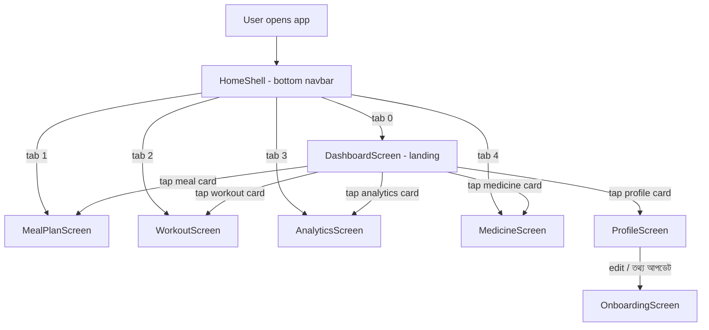
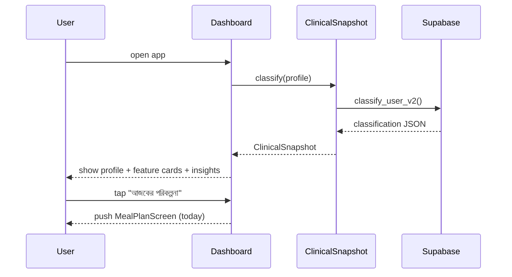
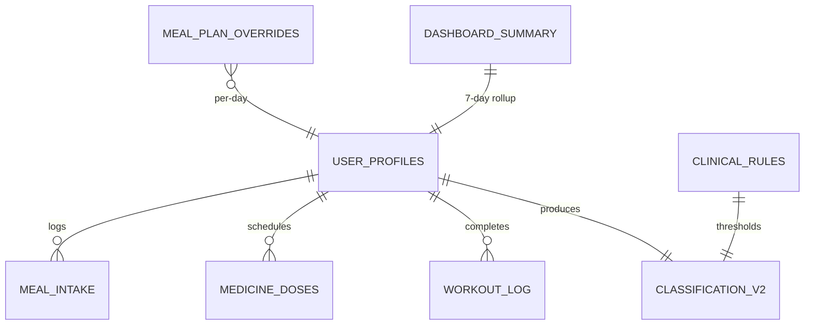

## Plan: Dashboard-First Redesign

**TL;DR**
Promote a brand-new `DashboardScreen` to be the app's first tab and landing surface, using the bold magenta + dark-card visual language from the reference. It hosts the profile card on top, plus quick stat tiles and large feature cards for Meal Plan, Workout, Medicine, Analytics, Clinical Insights, and Date/Progress details. The bottom navbar becomes 5 tabs (Dashboard / Meal / Workout / Analytics / Medicine — profile removed). Profile screen and Meal plan screen lose the inline clinical info / personalization row that previously lived there — those details now live exclusively on the Dashboard.

**Steps**

1. **Reorder `HomeShell` tabs to put Dashboard first** *(depends on nothing)* — in `lib/screens/home_shell.dart` reorder `_NavItems` so index 0 = Dashboard, 1 = Meal, 2 = Workout, 3 = Analytics, 4 = Medicine; remove the Profile entry; update `_buildPage` to match; change default tab to 0.
2. **Re-skin `HomeShell` notch bar with magenta accent** *(parallel with 1)* — replace `notchColor: AppColors.ink` and `paper` surface with the new magenta tokens (`AppColors.brandPink`, `AppColors.brandPinkDeep`); update active-icon colour; ensure FABs/scaffolds across the app keep using existing tokens so only the bar changes.
3. **Introduce new brand tokens in `lib/theme/app_theme.dart`** *(depends on 1, parallel with 4–9)* — add `AppColors.brandPink` (e.g. `#F6A6C5`), `AppColors.brandPinkDeep` (`#EC7AA1`), `AppColors.brandMaroon` (e.g. `#1F1018`), `AppColors.brandSurface` (`#FFF1F5`), `AppColors.brandLine` (`#EFD3E0`), and a matching `AppGradients.brandMaroon` + `AppGradients.brandMagenta`; keep the existing tokens so other screens (Profile, Meal plan) continue compiling.
4. **Build new `DashboardScreen` as the landing page** *(depends on 2, 3)* — replace `lib/screens/dashboard_screen.dart` contents with a clean slate that composes:
   - **Profile card** at the very top: avatar + name + greeting + BMI/glucose mini-stats; tap → push `ProfileScreen` (full screen).
   - **Today's summary strip**: today's date in Bangla + a one-line status (e.g. "আজ ৪ বেলা পরিকল্পনা আছে") + a "ম্যাক্রো অগ্রগতি" mini bar (carb / kcal / sodium vs targets if `_cls2` is available).
   - **"আজকের পরিকল্পনা" feature card** (large): mini list of next 1-2 meals with thumbnail + slot time; tap → `MealPlanScreen` (initialDay = today).
   - **"ব্যায়াম" feature card**: today's workout name + duration + a "শুরু করুন" CTA; tap → `WorkoutScreen`.
   - **"ওষুধ" feature card**: next scheduled dose with time + taken/pending pill chips; tap → `MedicineScreen`.
   - **"অ্যানালিটিক্স" feature card**: 7-day streak + a sparkline (good/moderate/bad ratio); tap → keep the current analytics dashboard route (see step 5).
   - **"বিকটিগত পরামর্শ"** (clinical insights) **card**: a curated subset of the legacy personalization row — glucose tier, BP tier, per-meal carb cap, food preference chips, recommendations + warnings — all in one section, reusing `_cls2` / `_cls` from `MealPlanScreen` logic (extract into a shared helper if needed; see step 6).
   - **"আজকের বিস্তারিত"** (date details) **card**: total kcal / carbs / protein / fat / sodium for today vs targets, plus a "সীমা ছাড়িয়েছে" red highlight when over.
   - Use the bold magenta + dark-card palette — magenta header background, dark cards with white text inside, white surface tiles for the feature cards with magenta accent icons.
5. **Convert current `DashboardScreen` analytics content into `AnalyticsScreen`** *(depends on 1, parallel with 4)* — move all the existing fl_chart streak / ratio bars / weekly chart / macro averages code out of `dashboard_screen.dart` into a new `lib/screens/analytics_screen.dart` so it can be reached via the navbar's 4th tab; keep `DashboardScreen` lean.
6. **Extract a shared `ClinicalSnapshot` model + helper** *(depends on 3, parallel with 4, 5)* — add `lib/widgets/clinical_snapshot.dart` (or similar) that takes a `UserProfile` and returns a `ClinicalSnapshot { glucoseLabel, bpLabel, carbCap, sodiumCap, kcalTarget, preferenceLabel, recommendations, warnings }`. Have the new `DashboardScreen` and (deprecated) `ProfileScreen` classification card use it. This is the single source of truth for clinical context.
7. **Slim `MealPlanScreen` — remove `_buildPersonalizationRow`** *(depends on 4)* — in `lib/screens/meal_plan_screen.dart` delete `_buildPersonalizationRow()` + `_TotalsMini` + `_tierLabel` + `_prefLabel`; remove the call from `_buildScheduleScaffold`; keep the date strip + meal cards + FAB untouched. Add a small "বিস্তারিত দেখুন" link/button in the header that pushes a tiny bottom sheet OR pushes `DashboardScreen` tab (use a `SwitchToTab` callback prop wired from `HomeShell` if needed).
8. **Slim `ProfileScreen` — remove inline clinical details card** *(depends on 4, 6)* — in `lib/screens/profile_screen.dart` remove `_vitalsCard`, `_classificationCard` / `_legacyClassificationCard`, `_inlineEditCard`, `_persistField`, and the `_UserProfileCopyWith` extension; keep only `_accountCard`, `_conditionsCard`, the photo upload, the `তথ্য আপডেট করুন` (full onboarding) button, and `লগ আউট`. The clinical detail card is now reached from the Dashboard's `বিকটিগত পরামর্শ` section.
9. **Wire Dashboard → Profile / Meal / Workout / Medicine / Analytics pushes** *(depends on 4, 1)* — add a `onOpenTab: (int) → void` callback or a simple `Navigator.push` per card from `DashboardScreen`. Easiest: push the relevant screen directly via `MaterialPageRoute`. For tabs, prefer push — it keeps the back-stack obvious and avoids mutating `_index` from outside `HomeShell`.
10. **Polish pass** *(depends on 7, 8, 9)* — make sure every card on the Dashboard uses consistent padding (20 px), magenta accent for icons, dark cards for the profile/insights block, light cards for the feature blocks; add subtle `RevealOnEnter` stagger animations matching the existing app's motion language; verify the Bangla text reads naturally in all new strings.
11. **Verification** *(depends on 10)* — `flutter analyze` + manual smoke: tap each dashboard card and confirm the right destination opens, confirm profile/meal screens compile without referencing removed symbols, confirm the back-stack pops to Dashboard.

**Relevant files**
- `lib/screens/home_shell.dart` — reorder tabs to Dashboard / Meal / Workout / Analytics / Medicine, reskin notch bar with magenta.
- `lib/screens/dashboard_screen.dart` — rebuild as the landing page with profile + feature cards + clinical insights.
- `lib/screens/analytics_screen.dart` — **new** file, holds the existing fl_chart dashboard content.
- `lib/screens/meal_plan_screen.dart` — delete `_buildPersonalizationRow` + `_TotalsMini` + helpers; remove call site.
- `lib/screens/profile_screen.dart` — delete `_vitalsCard`, `_classificationCard` / `_legacyClassificationCard`, `_inlineEditCard`, `_persistField`, `_UserProfileCopyWith`; keep account card, conditions card, photo upload, edit button, logout.
- `lib/theme/app_theme.dart` — add brand magenta / maroon / surface tokens.
- `lib/widgets/clinical_snapshot.dart` — **new** shared helper for glucose tier / BP tier / carb cap / sodium cap / kcal target / preference / recommendations / warnings.
- `lib/services/supabase_service.dart` — no changes expected (reuse existing RPCs); verify nothing inline-edit specific is referenced from `ProfileScreen`.

**Diagrams**

**Verification**
1. `flutter analyze` returns 0 errors and 0 warnings (all removed symbols cleaned from `MealPlanScreen` and `ProfileScreen`).
2. App launches into the new `DashboardScreen`; bottom bar shows 5 icons in order Dashboard / Meal / Workout / Analytics / Medicine.
3. Each dashboard card pushes the correct destination on tap.
4. `MealPlanScreen` no longer renders the personalization row under the date strip; the meal cards and FAB still work.
5. `ProfileScreen` no longer renders vitals / classification / inline-edit cards; account card, photo upload, conditions chips, edit button, and logout still work.
6. Bangla strings read naturally and use the magenta + dark-card palette consistently.
