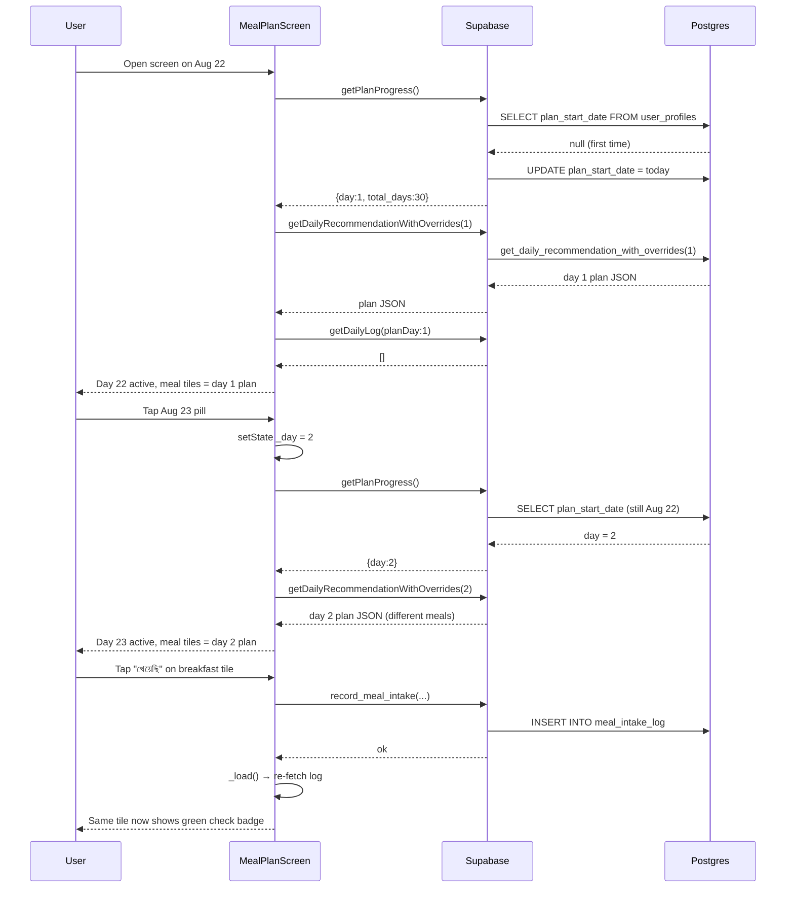
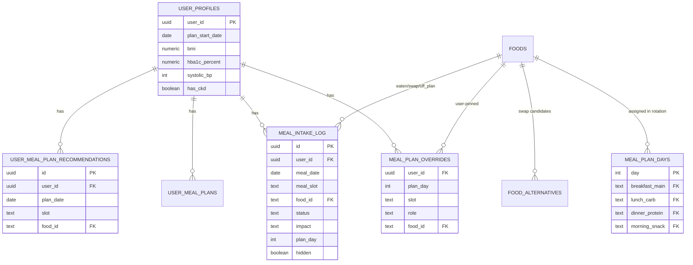

## Plan: Meal Plan Date + Eaten Indicator Fix

**TL;DR** — Three real bugs are stacked on top of each other in the meal-plan screen and the override RPC. (1) The date strip always uses `_day = offset + 1` while the server reports `progress.day` from `plan_start_date`; on every load the two can disagree, so the screen either shows the wrong day's meals or silently re-uses the previous day's response. (2) `get_daily_recommendation_with_overrides(p_plan_day)` calls `public.get_daily_recommendation(p_plan_day)` positionally, which now (after `24_daily_recommendation_v2.sql`) is shimmed to `(p_user_id uuid, p_day int)` — so the inner call errors every time and Flutter silently falls back to the simpler RPC. (3) `_ScheduleMealCard` renders no visual state for "this slot has been eaten/swapped", so even after a successful log the card looks identical to a planned-but-not-eaten one. Fix all three plus add an explicit "�জ / গতকাল / আগামীকাল" rail so the user can move freely in both directions.

**Steps**

1. **Add an end-to-end diagnostic log inside `_MealPlanScreenState._load()`** — log `progress.day`, `progress.daysElapsed`, `progress.planStartDate`, the chosen `targetDay`, the raw RPC result keys, and `result['day']`/`result['plan_day']`. Run the app once on a clean state and once after a day rollover. This is read-only and will pinpoint whether the bug is in date mapping or RPC content. (depends on nothing, parallel with #2.)

2. **Fix the SQL argument mismatch in `supabasesql/11_ai_plan_overrides.sql`** — change the inner `public.get_daily_recommendation(p_plan_day)` call to `public.get_daily_recommendation(auth.uid(), p_plan_day)`. Re-run the file in Supabase SQL Editor (it is `create or replace`, so it's idempotent). This eliminates the silent fallback that was hiding whether the override RPC was succeeding. (depends on nothing, parallel with #3.)

3. **Fix the date-strip ↔ server plan-day mapping in `lib/screens/meal_plan_screen.dart`** — the strip renders today + 0..6 with `_day = (i + 1)`, but `progress.day` is `(today - plan_start_date) % 30 + 1`. Refactor `_buildDateStrip` so:
   - The list of dates it shows is **centered on the active plan day**, not on today's calendar date.
   - The first pill in the strip is always `progress.day` (today's plan slot), the second is the next plan slot, etc.
   - `progress.day` is recomputed whenever the user taps a pill so day → calendar mapping stays correct as they swipe forward into the next 30-day cycle.
   - `getPlanProgress` should be called once per day-load, not per pill-tap; cache it for the session.
   - Keep `progress.day == _todayDayIndex` as the canonical "today" — when the user is viewing today, the strip's first pill matches the calendar's today. (depends on #1.)

4. **Add a "আজ / গতকাল / আগামীকাল" rail above the date strip** — three large Bangla buttons that snap `_day` to the calendar day directly. Yesterday = `(progress.day - 1) wrapped to 1..30`. Tomorrow = `(progress.day + 1) wrapped to 1..30`. Today = `progress.day`. This is the user's mental model and removes the need to figure out which pill is "today". (depends on #3.)

5. **Surface eaten/log state on each `_ScheduleMealCard`** — the screen already fetches `_todayLog` (a `Map<String, MealLogEntry>` keyed by `slot|foodId`) in `_load()` but never uses it. Pipe the log into the card widget:
   - If a meal for `(slot, role, foodId)` exists in the log with `status == 'eaten'` → show a green check badge over the image + a subtle desaturated filter + an "খাওয়া হয়েছে" subtitle row.
   - If `status == 'swap'` → show an "বিকল্প" badge and the swapped food's name as the subtitle.
   - If `status == 'off_plan'` → show an "পরিকল্পনার বাইরে" badge with the free-text food name.
   - A long-press on the badge opens a "ভুল হয়েছে, পূর্বাবস্থায় ফেরান" action that hides the log row (server already supports `hidden = true` via `05_meal_intake_actions.sql`). (depends on nothing; can be built once `_todayLog` is plumbed through.)

6. **Make the date-strip tap re-fetch reliably** — `_load()` currently fires from `setState(() => _day = newDay); _load();`. The new `targetDay` selection branch in `_load()` already correctly prefers `_day` when `hadToday != null`, but the bug is that `progress.day` is also re-read on every tap, and on the first tap after a calendar-day rollover it can equal the old `progress.day` from before the date changed. Guard against this by computing `progress.day` exactly once per UTC-day and reusing it inside the screen state until midnight. (depends on #3.)

7. **Verify with the dashboard's "Today's meals" widget** — `lib/screens/dashboard_screen.dart` already pulls `get_daily_log` and shows the meal list. After the above fixes, the same log entries should appear both in the meal-plan screen (as a badge on each card) and in the dashboard (as a timeline). This is the cheapest end-to-end smoke test: log a meal, check both screens show the same state. (depends on #5.)

**Relevant files**

- `lib/screens/meal_plan_screen.dart` — date strip + `_load()` + `_ScheduleMealCard`; biggest surface area for the fix. The unused `_todayLog` map and the `setState(() => _day = newDay); _load();` call site are the two edit points.
- `lib/services/supabase_service.dart` — `getDailyRecommendationWithOverrides(int day)` calls the override RPC; if #2 is fixed this no longer needs the `catch (_) → fallback` arm, but leave it as a safety net.
- `lib/models/user_meal_plan.dart` — `PlanProgress` already carries `planStartDate`; use it to compute yesterday/tomorrow plan-day indices.
- `lib/models/meal_item.dart` — `MealSlotPlan` already has `source`; extend with an optional `logStatus`/`logEntry` so the card knows whether the user ate it. (Lightweight change — just two nullable fields + `copyWith`.)
- `supabasesql/11_ai_plan_overrides.sql` — single-line fix on the inner `get_daily_recommendation` call.
- `supabasesql/02_rpcs.sql` and `supabasesql/24_daily_recommendation_v2.sql` — read-only reference; confirm the `(p_user_id uuid, p_day int)` signature is what the override RPC should call into.
- `lib/screens/dashboard_screen.dart` — read-only verification target for #7.

**Diagrams**

```mermaid
flowchart LR
    A[App opens] --> B[getPlanProgress]
    B --> C{plan_start_date set?}
    C -- no --> D[stamp plan_start_date = today]
    C -- yes --> E[compute day = (today - start) mod 30 + 1]
    D --> E
    E --> F[Render date strip centered on progress.day]
    F --> G[User taps pill]
    G --> H[setState _day = newDay]
    H --> I[getDailyRecommendationWithOverrides newDay]
    I --> J[get_daily_recommendation_with_overrides p_plan_day]
    J -- ok --> K[Merge overrides into baseline]
    J -- arg error --> L[Fallback getDailyRecommendation user_id + day]
    K --> M[Expand plan into MealSlotPlan list]
    L --> M
    M --> N[Join with meal_intake_log for badge state]
    N --> O[Render _ScheduleMealCard with badge]
```





**Verification**

1. `flutter run -d <device>` and exercise: open on day 22 → see plan A. Tap day 23 → see plan B (different foods). Wait for midnight or temporarily set device clock → see plan C. Long-press an eaten tile → see "undo" affordance. Tap undo → meal returns to "planned" state.
2. Manually `SELECT plan_start_date, plan_day FROM get_plan_progress();` in Supabase SQL Editor for the test user on day 22 and day 23; confirm `day` increments by 1.
3. Check the SQL RPC directly: `SELECT public.get_daily_recommendation_with_overrides(2);` returns the day-2 plan (different from day 1); same query with arg `1` returns day-1. After step #2, neither call should error.
4. Confirm `meal_intake_log` has rows with `meal_date = today`, `status = 'eaten'`, and the dashboard's "today's meals" widget shows the same foods as the meal-plan screen's badges.
