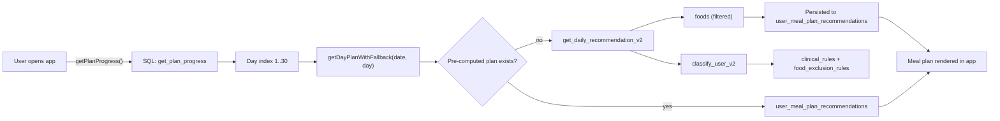
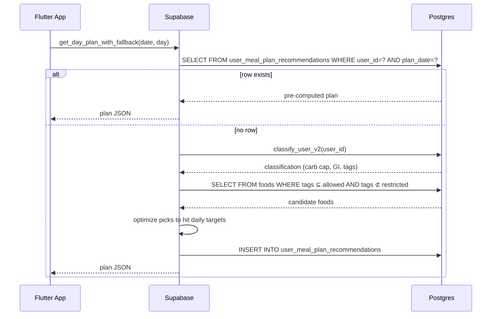
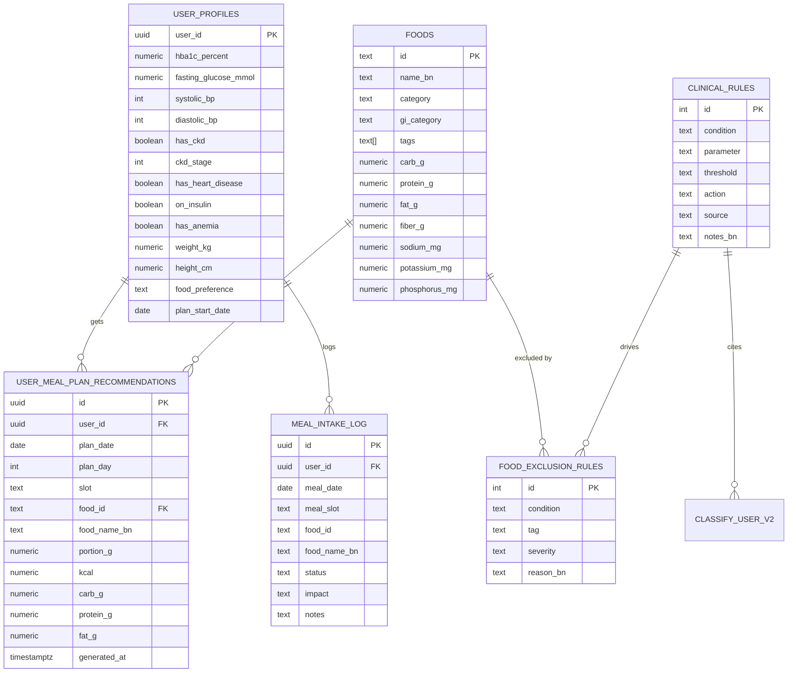

## Plan: Diabetes Meal Plan Overhaul

**TL;DR**
Rebuild the meal recommendation engine so plans are generated per-user from their clinical profile (HbA1c, BMI, BP, CKD stage, heart disease, fasting glucose, insulin, anemia) using locked clinical rules. Add a full health dashboard to the profile screen with in-place editing and a restricted-foods panel. Improve the tick/done flow to show personalized impact and reasoning. Keep the 30-day rotation but make it dynamic.

**Important disclaimer**: Thresholds and CKD rules will be locked to published guidelines (ADA Standards of Care 2024, KDIGO 2024 CKD, ACC/AHA 2017 BP, ICMR 2024 Indian dietary guidelines, WHO South-East Asia dietary targets). A clinical reviewer should still sign off before production.

---

### Phase 1 — SQL foundation

**Step 1. Create clinical rules reference table** (depends on nothing)
- New file `supabasesql/22_clinical_rules.sql`
- Table `clinical_rules` (id, condition, parameter, threshold, action, source, notes_bn)
- Seed with ADA/KDIGO/ACC-AHA cutoffs used by the engine
- Apply to Supabase

**Step 2. Add condition-based meal exclusion table** (depends on Step 1)
- Same file `22_clinical_rules.sql`
- New table `food_exclusion_rules` (condition, tag, severity, reason_bn)
- Maps each condition to which food tags/categories are excluded
- RLS: read-only authenticated

**Step 3. Rewrite `classify_user` RPC** (depends on Step 1)
- New file `supabasesql/23_classify_v2.sql`
- Drop old `classify_user`, replace with version that:
  - Computes HbA1c tier (good/moderate/poor) using ADA 2024 cutoffs
  - Computes fasting glucose tier (good/moderate/poor) using ADA 2024
  - Computes BMI tier (Asian cutoffs, WHO SEAR)
  - Computes BP tier (ACC/AHA 2017)
  - Computes CKD stage and applies KDIGO 2024 dietary restrictions
  - Returns `carb_cap_per_meal_g`, `daily_carb_target_g`, `daily_protein_target_g`, `daily_fat_target_g`, `allowed_gi`, `allowed_tags`, `restricted_tags`, `warnings_bn`, `recommendations_bn`
- Returns structured JSON consumed by Flutter
- Apply to Supabase

**Step 4. Rewrite `get_daily_recommendation` to be fully dynamic** (depends on Step 2, 3)
- New file `supabasesql/24_daily_recommendation_v2.sql`
- For each slot (breakfast/lunch/dinner/snacks), the function:
  - Filters master `foods` table by `allowed_tags` and `allowed_gi`
  - Excludes foods whose tags intersect `restricted_tags`
  - Optimizes carb/protein/fat to hit daily targets
  - Picks from `meal_plan_days` rotation but overrides any food that violates the user's restrictions
  - Respects `food_preference` (omnivore/vegetarian/fish_only/no_beef) for every slot
- Returns a complete day plan with 4-alternatives per slot pre-computed
- Apply to Supabase

**Step 5. Add `get_recommendation_calendar(p_user_id, p_from_date, p_to_date)`** (depends on Step 4)
- Same file `24_daily_recommendation_v2.sql`
- Generates a calendar of upcoming days with personalized plan pre-baked
- Persists to `user_meal_plan_recommendations` table
- Apply to Supabase

**Step 6. Persist generated plans** (depends on Step 5)
- Same file `24_daily_recommendation_v2.sql`
- New table `user_meal_plan_recommendations` (user_id, plan_date, plan_day, slot, food_id, food_name_bn, portion_g, kcal, carb_g, protein_g, fat_g, generated_at)
- One row per (user, date, slot)
- RLS: per-user
- Apply to Supabase

**Step 7. Add `get_day_plan_with_fallback(p_date, p_plan_day)`** (depends on Step 6)
- Same file `24_daily_recommendation_v2.sql`
- Reads from `user_meal_plan_recommendations` first
- Falls back to `get_daily_recommendation_v2` if no row exists
- Returns the plan the Flutter app consumes
- Apply to Supabase

### Phase 2 — Flutter profile screen

**Step 8. Refactor `lib/screens/profile_screen.dart` to full health dashboard** (depends on Step 3)
- Replace single onboarding push pattern with a tabbed/expandable layout
- Add sections:
  - Account card (existing — keep)
  - Health metrics card (age, sex, weight, height, BMI, BP, glucose, HbA1c, medication) — each field tap-to-edit inline
  - Health conditions card (CKD with stage, heart disease, insulin, anemia) — tap-to-edit bottom sheet
  - Lifestyle card (activity level, meal size pref, food preference) — tap-to-edit
  - **NEW: Classification card** — current tier (glucose/BMI/BP), daily targets (carb/protein/fat), allowed GI list (in Bengali)
  - **NEW: Restricted foods panel** — calls `ImpactEngine.judge` against current day's foods, lists bad ones with Bengali reason
  - **NEW: Warnings panel** — clinical recommendations from `classify_user` in Bengali
- Keep the "সম্পূর্ণ প্রোফাইল পুনরায় পূরণ" button as a fallback

**Step 9. Add in-place edit widgets** (depends on Step 8)
- New file `lib/widgets/inline_edit_field.dart`
- Wraps any value with tap → modal sheet → save → re-classify
- Show current value + edit icon
- Save calls `update_user_profile` RPC, then refreshes classification
- Reuse in profile screen

**Step 10. Wire `lib/widgets/restricted_foods_card.dart`** (depends on Step 8, `impact_engine.dart`)
- New file `lib/widgets/restricted_foods_card.dart`
- Fetches today's plan items
- Runs `ImpactEngine.judge` per food
- Shows `bad` items with Bengali reason and severity icon
- Reused on profile + an optional "today" sub-card

### Phase 3 — Flutter meal plan screen

**Step 11. Refactor `lib/screens/meal_plan_screen.dart`** (depends on Step 7)
- Replace `getDailyRecommendationWithOverrides` calls with `getDayPlanWithFallback(p_date, p_plan_day)`
- Day index now comes from `plan_start_date` math on the client (already works via `getPlanProgress`)
- Display personalization badges on each meal card ("good for you", "moderate", "avoid")
- Show personalized portions based on user's daily targets

**Step 12. Improve tick/done action sheet** (depends on Step 11)
- Replace 3-option sheet with a more guided flow:
  - "খেয়েছি" — logs with `record_meal_intake`
  - "বিকল্প দেখান" — fetch 4 alternatives from `food_alternatives_for`, each pre-judged by `ImpactEngine.judge` with Bengali reason
  - "অন্য কিছু খেয়েছি" — free-text log
- Each option now shows the personalized impact (kal, carb, protein, fat) in real time
- After logging, optimistic UI update + snackbar with the Bengali reason

**Step 13. Add `lib/services/plan_service.dart`** (depends on Step 11)
- New file — centralizes plan fetching/loading
- Methods: `getTodayPlan()`, `getPlanForDate(date)`, `getPlanProgress()`, `regeneratePlan()`
- Used by both `meal_plan_screen.dart` and `profile_screen.dart`

### Phase 4 — Flutter diet recommender

**Step 14. Add diet recommender service** (depends on Step 3)
- New file `lib/services/diet_recommender.dart`
- Local mirror of `classify_user` rules (offline judge)
- Methods: `getDailyTargets(cls)`, `getAllowedFoods(foods, cls)`, `getRestrictedFoods(foods, cls)`, `getMealPlanForDay(cls, day)`
- Uses published guideline thresholds
- Used by `restricted_foods_card.dart` and `impact_engine.dart`

**Step 15. Lock `lib/services/classification_engine.dart` to guidelines** (depends on Step 14)
- Update `classify()` to match the SQL `classify_user` v2 exactly
- Reference `clinical_rules` semantically (e.g. `>= 130 OR >= 80` for stage 1 BP)
- Document each rule with source citation in comments

**Step 16. Update `lib/services/impact_engine.dart`** (depends on Step 14)
- Extend `judge()` to consider:
  - CKD stage (different severity for K and Phos)
  - Heart disease severity
  - Insulin on board
  - Anemia (favor iron-rich foods)
- Return richer Bengali reasons with citations

### Phase 5 — Validation

**Step 17. Add unit tests for classification engine** (depends on Step 14)
- New file `test/classification_engine_test.dart`
- Test cases: HbA1c boundaries (6.4, 7.0, 8.5), fasting glucose boundaries, BMI Asian cutoffs, BP stages, CKD stages, combinations
- Each test asserts the expected tier and citation

**Step 18. Add integration tests for plan generation** (depends on Step 4)
- New file `test/plan_generation_test.dart`
- Test cases: vegetarian gets no meat, vegetarian gets no fish, no_beef excludes beef, high HbA1c caps carbs, CKD stage 3 excludes banana, BP stage 2 excludes high-sodium foods
- Run against Supabase test instance

### Relevant files

**SQL (new):**
- `supabasesql/22_clinical_rules.sql` — clinical rules reference + food exclusion rules
- `supabasesql/23_classify_v2.sql` — full `classify_user` v2 with citations
- `supabasesql/24_daily_recommendation_v2.sql` — dynamic plan generation + calendar + persistence

**SQL (modify):**
- `supabasesql/02_rpcs.sql` — remove old `classify_user` and `get_daily_recommendation` (they live in 22/23/24 now)

**Flutter (new):**
- `lib/widgets/inline_edit_field.dart` — tap-to-edit widget
- `lib/widgets/restricted_foods_card.dart` — restricted foods panel
- `lib/services/plan_service.dart` — plan fetching centralization
- `lib/services/diet_recommender.dart` — local diet recommender
- `test/classification_engine_test.dart` — unit tests
- `test/plan_generation_test.dart` — integration tests

**Flutter (modify):**
- `lib/screens/profile_screen.dart` — full health dashboard
- `lib/screens/meal_plan_screen.dart` — uses new RPC, richer cards
- `lib/services/supabase_service.dart` — replaces/keeps RPC methods
- `lib/services/classification_engine.dart` — locks to guidelines
- `lib/services/impact_engine.dart` — richer Bengali reasons
- `lib/models/user_meal_plan.dart` — updates if response shape changes

**Reference:**
- `lib/services/impact_engine.dart` — Bengali reason strings already exist
- `lib/services/classification_engine.dart` — current classifier (will be replaced)
- `README.md` — note that the meal recommender is now dynamic

### Diagrams

**Overall architecture after the overhaul:**

**Daily plan generation flow:**

**Data model after the overhaul:**

### Verification

**SQL:**
1. Run all new SQL files in order against Supabase SQL Editor
2. `select classify_user_v2((select user_id from user_profiles limit 1))` — confirm returns full JSON with citations
3. `select * from get_daily_recommendation_v2('user-id', 1)` — confirm dynamic filtering
4. Verify RLS: `select * from user_meal_plan_recommendations where user_id != auth.uid()` returns nothing

**Flutter:**
1. `flutter test test/classification_engine_test.dart` — rule boundaries pass
2. `flutter test test/plan_generation_test.dart` — plan generation tests pass
3. `flutter run` — manual smoke test:
   - Onboard a new user with HbA1c 8.0, BP 145/92, CKD stage 3
   - Confirm plan excludes banana, high-sodium foods, high-phosphorus foods
   - Log a meal as "খেয়েছি" and confirm Bengali impact reason appears
   - Log a meal as "বিকল্প" and confirm 4 alternatives with personalized reasons
   - Open profile, confirm restricted foods panel shows the same exclusives
   - Edit HbA1c from 8.0 to 7.0 in profile, confirm plan updates next day

**Manual review:**
1. Have a clinician spot-check 10 random generated plans against the guidelines
2. Confirm no raw English codes appear in the UI
3. Confirm day wraparound works after 30 days

### What you need to run

**SQL (run in this order in Supabase SQL Editor):**
1. `supabasesql/22_clinical_rules.sql`
2. `supabasesql/23_classify_v2.sql`
3. `supabasesql/24_daily_recommendation_v2.sql`
4. (Optional) `supabasesql/02_rpcs.sql` if you want to remove old functions

**Flutter:**
1. `flutter pub get` (no new packages needed)
2. `flutter run` — verify meal plan is now personalized
3. `flutter test` — verify unit + integration tests pass

**Before production:**
1. Get a clinician (diabetologist + nephrologist) to review `clinical_rules` and `food_exclusion_rules` against published guidelines
2. Add disclaimer in onboarding: "এই পরামর্শ সাধারণ নির্দেশিকা অনুসরণ করে — ব্যক্তিগত চিকিৎসার জন্য ডাক্তারের পরামর্শ নিন"
