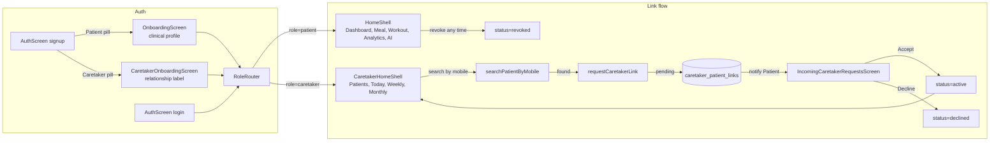
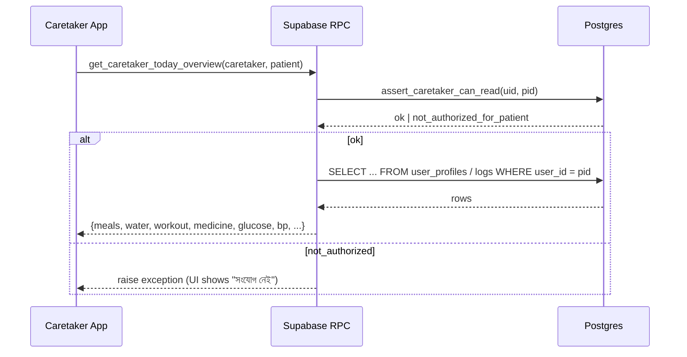
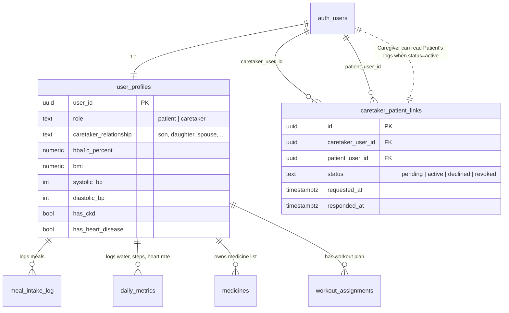

## Plan: Two-Role Patient/Caretaker System

**TL;DR**
Introduce a `role` column on `user_profiles` (`patient` | `caretaker`), a new `caretaker_patient_links` table with patient-driven approval (`pending → active | declined | revoked`), and a parallel `CaretakerHomeShell` that gives the connected Caretaker a read-only monitoring experience over the Patient's existing data (meals, water, workouts, medicine, BP, sugar, clinical profile). Signup gains a 3-way role pill (existing Patient flow + new Caretaker flow that skips clinical onboarding and asks for a relationship label instead). The root `AmarDietApp` routes Patient→existing `HomeShell`, Caretaker→new `CaretakerHomeShell`. Existing users auto-migrate to `patient` on first launch via a server-side default. Schema, RLS, RPCs, models, screens, and Caretaker UI all ship together.

---

### Steps

#### Phase A — Database (Supabase)

1. **New SQL file `28_roles_and_caretaker.sql`** — schema for role + linking. *(depends on A2 for trigger logic)*
   - `alter table public.user_profiles add column role text not null default 'patient' check (role in ('patient','caretaker'))` — backfills all existing rows as `'patient'`.
   - `alter table public.user_profiles add column caretaker_relationship text` — free-text label (`'son'`, `'daughter'`, `'spouse'`, …) for Caretakers.
   - `create table public.caretaker_patient_links (id uuid pk, caretaker_user_id uuid, patient_user_id uuid, status text check (status in ('pending','active','declined','revoked')), requested_at, responded_at, last_seen_at, …)` with unique partial index `(caretaker_user_id, patient_user_id) where status in ('pending','active')` so you can't have two open requests.
   - Enable RLS; policies:
     - **Caretaker** can SELECT only rows where `caretaker_user_id = auth.uid()`.
     - **Patient** can SELECT only rows where `patient_user_id = auth.uid()`.
     - INSERT (request): only as the caretaker (`auth.uid() = caretaker_user_id`), `status='pending'`.
     - UPDATE (accept/decline/revoke): only the patient on incoming rows, only the caretaker on outgoing pending rows (for cancel).
   - Trigger on `caretaker_patient_links` after UPDATE — fires a Supabase notification (broadcast channel `caretaker_link_<uid>`) so the recipient's app can refresh.

2. **Migration backfill RPC `backfill_role_for_existing_users()`** *(A1 ships with this inline)*
   - Idempotent — just sets `role='patient'` for any row where it's null.

3. **New SQL file `29_caretaker_read_rpcs.sql`** — read-only server functions the Caretaker UI calls. *(depends on A1)*
   - All RPCs are `security definer` and take `p_caretaker_user_id` + `p_patient_user_id`, then internally `assert_caretaker_can_read(uid, pid)` raises `not_authorized_for_patient` if the link is not `active`.
   - `get_caretaker_patient_list(p_caretaker)` — returns one row per active link: `{patient_user_id, full_name, mobile, age, photo_url, last_log_at, today_adherence_pct, last_active_at}`. Ordered by `last_log_at desc nulls last`.
   - `get_caretaker_today_overview(p_caretaker, p_patient)` — single round-trip: meals completed/planned, water ml/target, workout done/total, medicine taken/total, latest fasting glucose + systolic/diastolic + recorded_at, last_logged_meal_at, last_workout_at.
   - `get_caretaker_daily_breakdown(p_caretaker, p_patient, p_from_date, p_to_date)` — array of `{date, meals_pct, water_pct, workout_pct, med_pct}` for the chart (max 90 rows = 3 months).
   - `get_caretaker_recent_activities(p_caretaker, p_patient, p_limit)` — last 30 mixed events (meal eaten/skipped, water glass, workout done, medicine taken/missed, BP/sugar reading) sorted desc.
   - `get_caretaker_clinical_snapshot(p_caretaker, p_patient)` — read-only view of the patient's `user_profiles` clinical fields (HbA1c, BMI, BP tier, CKD, heart disease, classification) — reuses `classify_user_v2(patient_uid)` server-side.
   - `search_patient_by_mobile(p_caretaker, p_mobile)` — returns `{user_id, full_name, age, sex}` for the matching Patient; if no match, returns one row with `found=false`. Restricts to Patients (`role='patient'`) and only exposes the link-eligible fields (no email, no clinical data).

4. **Extend `record_meal_intake`, `add_water_liters`, `setSteps`, `mark_dose`, `finish_workout_session` with `p_logged_by uuid default null` parameter**
   - Server stores `logged_by` = `auth.uid()` of whoever wrote it (Patient or Caretaker). No behavior change for Patient writes (defaults to their own uid).
   - Caretaker app does NOT call these — Caretaker is read-only per the user's clarification — but having the column in place means the activity feed can later say "Father logged lunch" vs "Son marked lunch on father's behalf".

---

#### Phase B — Flutter models + service layer

5. **New `lib/models/user_role.dart`** — `enum UserRole { patient, caretaker }`, plus `CaretakerPatientLink` (status enum), `CaretakerPatientCard`, `CaretakerTodayOverview`, `CaretakerDailyStat`, `CaretakerRecentActivity`, `CaretakerClinicalSnapshot`. *(depends on A3 for the shapes)*

6. **Extend `lib/models/user_profile.dart`** with `role` and `caretakerRelationship`. Update `toSupabaseRow` and `copyWith` to include them.

7. **Extend `lib/services/supabase_service.dart`** with:
   - `fetchMyProfile()` (already exists; extend to read role).
   - `searchPatientByMobile(String)` → `Future<CaretakerPatientSearchResult?>`.
   - `requestCaretakerLink({patientUserId})` → `Future<String>` (returns request id).
   - `respondToCaretakerLink({linkId, accept})` → `Future<void>` (Patient's accept/decline).
   - `revokeCaretakerLink({linkId})` → `Future<void>` (either side revokes an active link).
   - `listMyCaretakerPatients()` → `Future<List<CaretakerPatientCard>>`.
   - `listIncomingCaretakerRequests()` → `Future<List<CaretakerPatientLink>>`.
   - `getCaretakerTodayOverview(patientId)`.
   - `getCaretakerDailyBreakdown(patientId, from, to)`.
   - `getCaretakerRecentActivities(patientId, limit)`.
   - `getCaretakerClinicalSnapshot(patientId)`.
   - `subscribeToMyLinkEvents()` → `Stream<CaretakerLinkEvent>` (wraps Supabase Realtime channel; used to refresh lists when patient accepts/declines).

8. **New `lib/services/role_router.dart`** — decides after login which shell to mount.
   - Reads `UserProfile.role`. Patient → `HomeShell` (unchanged). Caretaker → `CaretakerHomeShell`.
   - Exposes `currentRole` as a `ValueNotifier<UserRole?>` so any screen can react (e.g. drawer hides medication-editor for Caretakers).
   - Listens to Supabase auth state changes; on sign-in, fetches profile once and caches role + relationship.

---

#### Phase C — Onboarding + signup (Patient + Caretaker)

9. **Update `lib/screens/auth_screen.dart`** — add a third pill `Caregiver` to the `MonoSegmented`. *(depends on B6)*
   - When Caretaker mode is selected, the existing `name + mobile + email + password` form stays but the helper copy changes to "তুমি কার জন্য দেখাশোনা করবে সেটা পরে সেট করতে পারবে". After successful signup, skip `OnboardingScreen` and route to `CaretakerOnboardingScreen`.
   - Patient path is unchanged.

10. **New `lib/screens/caretaker_onboarding_screen.dart`** — short flow the Caretaker fills once:
    - Bangla question: "রোগীর সাথে তোমার সম্পর্ক কী?" with chip choices (ছেলে / মেয়ে / স্বামী / স্ত্রী / ভাই / বোন / অন্যান্য) + optional custom text.
    - "প্রোফাইল ছবি যোগ করুন" (optional, reuses existing `uploadProfilePhoto`).
    - Single "শুরু করুন" button → navigates to `CaretakerHomeShell`.
    - Skips *all* clinical fields (HbA1c, BMI, BP, CKD, etc.) — Caretaker has no own patient data.

11. **Patient side: add "পরিবারের সদস্যকে আমন্ত্রণ জানান" tile** in `ProfileScreen` *(depends on A1)*. Tapping opens `IncomingCaretakerRequestsScreen` — a small list of pending Caretaker requests with `Accept / Decline` buttons calling `respondToCaretakerLink`. Also a "Manage connected caretakers" screen to revoke active links.

12. **Caregiver `lib/screens/find_patient_screen.dart`** — the search-by-mobile flow.
    - One `01XXXXXXXXX` input field (reusing the `_Input` widget from `auth_screen.dart`).
    - On submit, calls `searchPatientByMobile`. Shows result card with name + age + sex + "সংযুক্ত হন" button.
    - Tapping "সংযুক্ত হন" calls `requestCaretakerLink` → shows success sheet "অনুরোধ পাঠানো হয়েছে, রোগী অনুমোদন করলে আপনি দেখতে পাবেন" → returns to Caretaker home.
    - If the Caretaker already has a pending/active link to that Patient, the button shows the existing status.

---

#### Phase D — Caretaker home shell + screens

13. **New `lib/screens/caretaker_home_shell.dart`** — mirrors the existing `HomeShell` shape but with 4 caretaker-specific tabs:
    - **Tab 0 — রোগী (Patients)**: list of active patients (avatar, name, age, "Last activity: 12 min ago"). Empty state for first-time Caretakers → big "তোমার প্রথম রোগীকে সংযুক্ত করো" CTA that opens `find_patient_screen`.
    - **Tab 1 — আজ (Today overview)**: shows the currently-selected patient's today stats; the top has a horizontal `PatientSelectorStrip` (avatars) if multiple patients are linked.
    - **Tab 2 — সাপ্তাহিক (Weekly)**: bar chart adherence per metric (meals / water / workout / medicine) + sparklines.
    - **Tab 3 — মাসিক (Monthly)**: bigger charts, best/worst day callouts.
    - Bottom nav uses the same `AnimatedNotchBottomBar` from `home_shell.dart` (icons-only, dark notch, white pill) — extracted to a shared widget in step 18.
    - Side drawer (mirrors `apon_susthota_shell.dart` style) with: patient switcher, "নতুন রোগী যোগ করুন", "আমন্ত্রণ অনুরোধ দেখুন" (pending outgoing requests), "প্রোফাইল" (own Caretaker profile), "লগআউট".

14. **New `lib/screens/caretaker_patient_detail_screen.dart`** — opens when a Caretaker taps a patient card. Single-screen dashboard:
    - **Patient header card** — avatar, name, age/sex, clinical classification tier (good/medium/bad + HbA1c + BMI), connection status, "কখনো সংযুক্তি বাতিল করবেন?" revoke button.
    - **আজকের সারসংক্ষেপ** (Today summary) grid: 🍽️ Meals completed/total, 💧 Water L of target, 🏃 Workout done/total, 💊 Medicine taken/total, 🩸 Latest glucose (with timestamp), ❤️ Latest BP (with timestamp). Each tile is tappable → opens a detail sub-screen.
    - **সাম্প্রতিক কার্যকলাপ** — timeline of last 20 events ("১২:৩০ — দুপুরের খাবার খেয়েছেন — ভাত, মুরগি, ডাল").
    - **দৈনিক/সাপ্তাহিক/মাসিক** segmented control below the summary — switches between the 3 views in-place using `getCaretakerDailyBreakdown` data.

15. **New `lib/screens/caretaker_chart_screen.dart`** — full-screen chart drilldown when a tile is tapped.
    - Fl_chart bar + line charts (reusing the existing `lib/screens/analytics_screen.dart` chart style — `BarChartData`, `LineChartData`).
    - Bangla tooltips on tap (e.g. "সোমবার — ৭৫% খাবার সম্পন্ন").

16. **Realtime notification nudge** *(depends on B7 stream)* — when the Patient logs a meal/water/medicine, the Caretaker's home screen receives the event via `subscribeToMyLinkEvents` and updates the "Last activity" pill instantly. No push notifications in this iteration (out of scope); it's in-app only via Supabase Realtime.

---

#### Phase E — Shared shell extraction

17. **Extract `NotchBottomBar` into `lib/widgets/notch_bottom_bar.dart`** *(depends on D13)*
    - Pull the `AnimatedNotchBottomBar` setup from `home_shell.dart` into a reusable widget that takes `List<_NavItem>`.
    - Refactor `home_shell.dart` to use the new widget (no behavior change for Patient).
    - Caretaker home shell builds the same widget with its 4 tabs.

18. **Add `role` to `DrawerProfileHeader`** *(depends on B6)* — render a small role chip next to the name in the drawer ("রোগী" or "দেখাশোনাকারী") so users always know which mode they're in. The chip is decorative only; navigation is still role-routed.

---

### Relevant files

**To create**
- `supabasesql/28_roles_and_caretaker.sql` — role column + links table + RLS + realtime broadcast trigger
- `supabasesql/29_caretaker_read_rpcs.sql` — read-only RPCs guarded by `assert_caretaker_can_read`
- `lib/models/user_role.dart` — `UserRole` enum, `CaretakerPatientLink`, `CaretakerPatientCard`, `CaretakerTodayOverview`, `CaretakerDailyStat`, `CaretakerRecentActivity`, `CaretakerClinicalSnapshot`, `CaretakerLinkEvent`
- `lib/services/role_router.dart` — decides Patient vs Caretaker shell
- `lib/screens/caretaker_onboarding_screen.dart`
- `lib/screens/find_patient_screen.dart`
- `lib/screens/caretaker_home_shell.dart`
- `lib/screens/caretaker_patient_detail_screen.dart`
- `lib/screens/caretaker_chart_screen.dart`
- `lib/screens/incoming_caretaker_requests_screen.dart` (Patient-side accept/decline list)
- `lib/widgets/notch_bottom_bar.dart` (extracted shared bottom-nav)
- `lib/widgets/caretaker_patient_card.dart` (reusable card)
- `lib/widgets/caretaker_metric_tile.dart` (the today's-stat grid tile)
- `lib/widgets/patient_selector_strip.dart` (horizontal avatar switcher for multi-patient Caretakers)

**To edit**
- `supabasesql/01_schema.sql` — add `role` + `caretaker_relationship` columns + indexes
- `supabasesql/05_meal_intake_actions.sql`, `12_medicine.sql`, `18_daily_metrics.sql`, `13_workouts.sql` — add optional `logged_by` column + update RPCs to accept it (defaults to `auth.uid()`)
- `lib/main.dart` — after `AmarDietApp.initState`, resolve role via `RoleRouter`; pass role into `home:` builder so it picks `HomeShell` vs `CaretakerHomeShell`
- `lib/screens/auth_screen.dart` — add third signup pill, route Caretaker signup to `CaretakerOnboardingScreen`
- `lib/screens/onboarding_screen.dart` — leave Patient flow as-is; gate it from running for Caretakers
- `lib/screens/profile_screen.dart` — add "পরিবারের সদস্যকে আমন্ত্রণ" tile + link to `IncomingCaretakerRequestsScreen`
- `lib/services/supabase_service.dart` — append new RPC wrappers from step 7
- `lib/models/user_profile.dart` — add `role` + `caretakerRelationship` to fields, `toSupabaseRow`, `copyWith`
- `lib/screens/home_shell.dart` — swap inline `AnimatedNotchBottomBar` for the new shared widget (no behavior change)
- `lib/widgets/apon_susthota_shell.dart` — add role chip to drawer profile header

### Diagrams

**Role routing + connection lifecycle** (auth → home shell → link approval):

**Caretaker read RPC gating** — every read goes through the same gate:

**Data model** (new + modified tables):

### Verification

1. **Server-side**
   - `supabasesql/28_*.sql` then `29_*.sql` apply cleanly on a fresh DB; idempotent re-runs no-op.
   - `select role, count(*) from user_profiles group by role;` after deploy shows all existing rows as `patient`.
   - RLS: `set role authenticated; set request.jwt.claim.sub = '<caretaker_uid>'; select * from caretaker_patient_links;` only returns rows where `caretaker_user_id = that_uid`.
   - Direct RPC call with an unrelated `patient_user_id` raises `not_authorized_for_patient`.
   - `search_patient_by_mobile` never returns email or clinical fields — only `{user_id, full_name, age, sex, found}`.

2. **Patient flow (no regression)**
   - Existing Patient can log in, sees the existing `HomeShell`, no UI changes except the new "পরিবারের সদস্যকে আমন্ত্রণ" tile.
   - Patient can search for an incoming request in `IncomingCaretakerRequestsScreen`, tap Accept, then see the Caretaker listed under "Manage connected caretakers" with a Revoke button.

3. **Caretaker flow**
   - Sign up with the Caretaker pill → goes to `CaretakerOnboardingScreen` → taps "সংযুক্ত করুন" → opens `find_patient_screen` → enters Patient mobile → sees result → sends request.
   - Patient (on another device/login) sees the pending request and accepts. Caretaker's patient list refreshes (via realtime channel) and shows the Patient card with `connected`.
   - Caretaker opens the patient detail screen and sees real meal/water/medicine/workout numbers from the Patient's existing data, including the existing charts.
   - Caretaker cannot find any "Log meal" / "Add water" / "Edit medicine" buttons — the screen only shows read-only data.

4. **Permission edge cases**
   - Caretaker A tries to view Patient B's data by passing B's uid directly: RPC raises, UI shows "সংযোগ নেই" and offers a "অনুরোধ পাঠান" CTA.
   - Patient revokes the link. Next read by the Caretaker raises → UI automatically routes them back to the patient list and shows "সংযোগ বাতিল করা হয়েছে" snackbar.
   - Caretaker signs out → `RoleRouter` clears role cache → on next login the right shell is chosen again.

5. **Migration safety**
   - Deploy order: `28_*.sql` first (adds columns, default `'patient'`, no data loss), then `29_*.sql`. Client release only after both are applied, so `fetchMyProfile()` never returns `role = null`.
   - A user who upgrades the client before the SQL is deployed will see role=null; `RoleRouter` defaults to Patient in that case to avoid blocking existing users.
